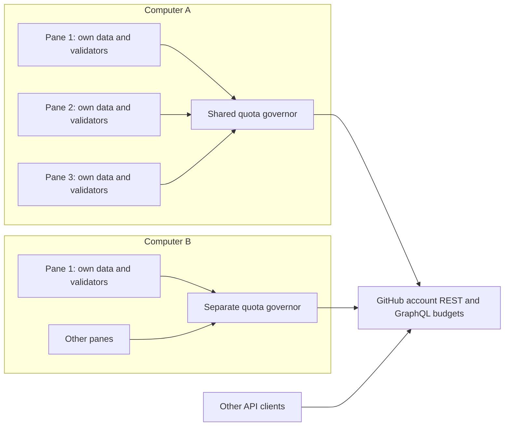
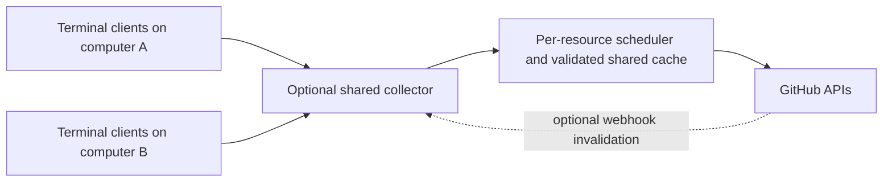

# Multi-instance API efficiency and architecture

Date: 2026-09-05  
Branch: `develop`  
Commit reviewed: `b819f42e87922671a35bb72052bd0ede445b74be`  
Version: 0.11.2 (`package.json:3`)  
Status: Research complete; implementation and release not performed.

## Conclusion

There are substantial opportunities to improve both efficiency and freshness without replacing the terminal UI or introducing a mandatory service. The central issue is that gh-glance coordinates **quota admission**, while each terminal still independently acquires its data. Several controller details then prolong waits even when actual REST usage is low. Different computers remain independent controllers competing for the same account budget. Evidence: `index.mjs:1720`, `index.mjs:2936`, `index.mjs:7327`; `docs/decisions/0003-file-backed-api-coordination.md:123`.

For the next release, prioritize accurate GraphQL accounting, recovery from excessive throttling, correct secondary-limit handling, and reduced polling demand. Shared local results are the most useful next architectural extension. An optional collector serving multiple computers is the stronger long-term answer for cross-device coordination, with additional operational cost. These recommendations are explicitly requested by the user; they are separated below from observations of the current implementation.

This research establishes code mechanisms and reproduces selected cases locally. It does not establish which installed version or exact sequence caused the user's current symptoms: no running user dashboards, tokens, account API counters, or live repository requests were inspected. Historical live measurements are identified as historical, not repeated observations.

## What exists today

The implementation already includes important protections:

- A file-backed governor with atomic reservations, fair local scheduling, bounded leases, start-time revalidation, and fail-closed storage. REST and GraphQL have separate resource budgets (`index.mjs:1473`, `index.mjs:1720`, `index.mjs:2406`, `index.mjs:3015`).
- A 20% reserve, giving 4,000 spendable units from a fresh 5,000-unit resource before other debits (`index.mjs:1350`, `index.mjs:1430`, `index.mjs:1508`).
- Conditional REST requests for Actions and Security, with matching 304 responses accounted at zero primary REST cost (`index.mjs:698`, `index.mjs:1030`, `index.mjs:1107`, `index.mjs:3588`).
- An authoritative REST observer using `/user` response headers and a persisted validator, while GraphQL still uses `/rate_limit` (`index.mjs:3950`, `index.mjs:4010`, `index.mjs:4036`).
- A five-second active-tab floor and one rotating background slot every four floors; each inactive tab is normally considered once per minute. Unchanged Security polling slows to at least one minute (`index.mjs:63`, `index.mjs:6157`, `index.mjs:6183`).
- Independent tab completion, last-known-good rows, unchanged-payload suppression, negative-result backoff, and per-process in-flight suppression (`index.mjs:3420`, `index.mjs:7324`, `index.mjs:7734`, `index.mjs:7930`).

ETags and a local lock are therefore existing features, not new recommendations. The current evolution is recorded in `CHANGELOG.md:22`, `CHANGELOG.md:47`, and `CHANGELOG.md:72`.



The arrows represent admission and subsequent API work, not a current data proxy. Each pane still launches its own `gh` subprocesses (`index.mjs:630`, `index.mjs:7327`).

## GitHub constraints relevant to this design

Ordinary authenticated REST access has a 5,000-request hourly user budget; personal tokens and user-authorized applications can share that budget. Another token or computer does not create another ordinary personal allowance. GraphQL has a separate primary budget, normally 5,000 points per user per hour. Installation-authenticated GitHub Apps have a different budget model. These ceilings vary with authentication and enterprise context. Sources: [REST rate limits](https://docs.github.com/en/rest/using-the-rest-api/rate-limits-for-the-rest-api), [GraphQL rate limits and query limits](https://docs.github.com/en/graphql/overview/rate-limits-and-query-limits-for-the-graphql-api).

An authenticated conditional request returning 304 saves primary REST quota. It still involves network/subprocess work and is not a blanket exemption from secondary limits. GitHub advises efficient polling, serial request queues, honoring `Retry-After`, and using webhooks where practical. Source: [REST API best practices](https://docs.github.com/en/rest/using-the-rest-api/best-practices-for-using-the-rest-api).

The published secondary constraints include concurrency, request-point rate, and server CPU limits. They are a different control problem from remaining hourly quota; GitHub can also apply unpublished limits. Source: [REST secondary rate limits](https://docs.github.com/en/rest/using-the-rest-api/rate-limits-for-the-rest-api#about-secondary-rate-limits).

### How demand scales

The table below is the application's **declared unpaced demand**, calculated by its exported `projectedHourlyCost()`, not observed API billing. It excludes manual actions, diagnostics, and observer overhead; it assumes the default five-second floor. Security uses its six-request upper bound. Actual admission, 304 results, Security's unchanged cadence, unavailable endpoints, and real GraphQL query cost change the outcome (`index.mjs:1302`, `index.mjs:3375`, `index.mjs:4066`).

| Active tab in every pane | Panes | REST units/hour, declared upper demand | GraphQL units/hour, declared demand |
|---|---:|---:|---:|
| Actions | 1 | 1,800 | 240 |
| Actions | 7 | 12,600 | 1,680 |
| Actions | 10 | 18,000 | 2,400 |
| Issues or PRs | 1 | 480 | 1,560 |
| Issues or PRs | 7 | 3,360 | 10,920 |
| Issues or PRs | 10 | 4,800 | 15,600 |
| Security | 1 | 4,440 | 240 |

Two implications follow. First, a governor must slow many panes under the current polling policy; a five-second interval cannot be promised for all workloads. Second, unused background tabs matter: an Actions pane still schedules Issues and PRs, and an Issues pane still schedules Actions and Security (`index.mjs:6183`). Duplicate panes and ten distinct repositories are different optimization cases: sharing results helps duplicates directly, while distinct repositories principally need better freshness priorities and lower query cost.

## Findings and opportunities

### 1. Shared quotas do not eliminate duplicate requests

**Confirmed design limitation.** The intent schema has no canonical repository/query identity, and coalescing matches the same lease, tab, and priority. Each App owns a separate entity `Map`. The persistent dashboard cache is loaded for initial display; it is not a stream of shared live responses (`index.mjs:2054`, `index.mjs:2936`, `index.mjs:7182`, `index.mjs:7327`).

**Recommendation:** add shared local acquisition keyed by effective host, canonical repository, authorization context, query parameters, and representation version. One owner fetches each due resource; other panes consume the last validated result and its freshness timestamp. Ownership must expire safely and followers must recover if an owner crashes. Keep this response store separate from quota authority.

For ten identical views, this could move acquisition from ten pollers toward one per refresh period. That is a theoretical upper opportunity for duplicate work, not a measured 90% saving across the user's mixed repositories. Different page sizes and permissions prevent unconditional sharing. Canonicalizing repository identity is also necessary: inferred cache targets currently use the working directory (`index.mjs:5930`).

A private file cache with per-query ownership could preserve the current installation model. A local socket broker makes subscriptions and connection reuse more natural but adds lifecycle management. ADR 0003 rejected a daemon for that complexity, not because response sharing was measured and found ineffective (`docs/decisions/0003-file-backed-api-coordination.md:134`).

### 2. GraphQL budget evidence remains non-authoritative

**Confirmed existing limitation.** Issues and PRs use `gh ... list --search`, declare two GraphQL units per fetch, and do not collect response counters (`index.mjs:1153`, `index.mjs:1168`, `index.mjs:1188`, `index.mjs:1203`, `index.mjs:1307`). The observer obtains GraphQL data from `/rate_limit` (`index.mjs:3950`, `index.mjs:4036`).

The August validation recorded a GraphQL probe that remained at 5,000 remaining while actual GraphQL response headers advanced. A 125-second freshness TTL addresses missing samples, not counter accuracy. That limitation is explicitly acknowledged in the accepted ADR and later notes (`docs/decisions/0003-file-backed-api-coordination.md:49`; `docs/plans/2026-08-29-conditional-polling-and-calm-status-notes.md:215`, `:243`).

**Recommendation:** issue narrow, independently completed GraphQL queries through `gh api graphql --include`, collecting response headers and query `rateLimit` data. Preserve delegated authentication and host routing. The transport already has an included-header parser (`index.mjs:651`); the [gh api manual](https://cli.github.com/manual/gh_api) documents header inclusion and pagination. Query cost and remaining-budget observations should replace assumed subprocess counts as evidence, while conservative admission still precedes execution.

This also requires redesigning epoch authority and stale-probe reconciliation. Simply accepting a good data header and allowing a later bad probe to replace it would not close the loop (`index.mjs:2706`, `index.mjs:2783`).

**Cost uncertainty:** the constant two is not proven to be a worst-case point bound across CLI versions, repository sizes, pagination, and selected fields. The installed CLI was 2.100.0. Its PR search implementation pages at 100 results and loops, while gh-glance requests 150. Its issue fragment asks for up to 100 labels even though the UI keeps only the first. Sources: [CLI PR search implementation, lines 92–123](https://github.com/cli/cli/blob/v2.100.0/pkg/cmd/pr/list/http.go#L92), [CLI issue field builder, lines 385–402](https://github.com/cli/cli/blob/v2.100.0/api/query_builder.go#L385); local consumers `index.mjs:103`, `index.mjs:1182`. This proves variable work and overfetch, not a measured quota overrun for the user's repositories.

### 3. Free REST outcomes still occupy fully priced queue time

**Confirmed algorithm behavior.** Admission advances the next resource slot by declared worst-case cost divided by its allowed rate. Actions reserves two units; Security reserves six. A 304 can settle at zero actual cost, but settlement retains the previously advanced lane deadline (`index.mjs:1046`, `index.mjs:1306`, `index.mjs:1841`, `index.mjs:2509`, `index.mjs:3073`).

At a fresh 5,000-unit budget with one hour remaining and a 1,000-unit reserve, a two-unit Actions slot occupies approximately 1.8 seconds. Ten panes occupy approximately 18 seconds of shared lane time before background work, subprocess latency, and external-use factors. The synthetic ten-pane schedule in this research put the final start at 16.665 seconds and the next lane deadline at 18.473 seconds; phase offsets and conservative reservation deductions explain the difference from simple multiplication. These are scheduler calculations, not measured display latency.

**Recommendation:** separate conservative primary-quota reservation from secondary-limit pacing, and make demonstrated cost reductions benefit subsequent scheduling. The next conditional request can return 200, so it must still have capacity reserved. Do not make all conditional requests free at admission. Recompute movable pending work safely after settlement rather than blindly rewinding deadlines already communicated to panes.

Cancelled scheduled reservations also leave their allocated lane time behind, so abandoned work can create empty slots (`index.mjs:2998`, `index.mjs:8441`). Treat cancellation and zero-cost settlement together in queue redesign.

### 4. External-use throttling can remain elevated after contention stops

**Confirmed algorithmic recovery gap.** Fewer than five completed local units makes `nextExternalFactor()` retain its previous factor. Nevertheless, publication resets the sampling baseline and clears local-used accumulation. Repeated small samples therefore never become one informative larger sample (`index.mjs:1393`, `index.mjs:1523`, `index.mjs:2820`, `index.mjs:3367`). The factor also carries across epochs (`index.mjs:2755`).

A synthetic local-only sequence of 120 samples, each with four local units and four global units, left a previously established factor of seven unchanged. With many 304s, small paid-use samples are plausible. This can both prolong an old slowdown and prevent sparse clients from learning new contention. It is a mechanism consistent with the user's symptoms, not proof of their current stored factor.

**Recommendation:** accumulate samples until they are informative, define bounded recovery for long idle periods, and test epoch transitions. Keep the authoritative reserve and actual counter changes as the safety boundary; tuning the estimator should not become permission to overspend. Acceptance should demonstrate recovery after another computer stops polling.

### 5. Some equivalent credentials create separate local governors

**Confirmed coordination fragmentation.** `authCacheIdentity()` hashes the configuration directory, `hosts.yml` metadata, and all four supported token environment variables. The governor uses that same fingerprint for its state filename (`index.mjs:1905`, `index.mjs:1913`, `index.mjs:5888`).

Synthetic examples confirmed that adding an unused enterprise token changes the github.com scope while `GH_TOKEN` remains identical. Putting identical token bytes in `GH_TOKEN` versus `GITHUB_TOKEN` also changes the fingerprint. These panes can target the same effective credentials while failing to share local admission and cooldowns.

**Recommendation:** separate budget identity from private response-cache identity. Determine the effective credential for the selected host and map it to the applicable quota principal where safely possible. Keep authorization-sensitive responses partitioned even when several credentials share a user budget. Account ID alone is insufficient as a universal key: user credentials and installation credentials can have different quota and access boundaries.

Changing one hash is not enough; scope migration, credential precedence, authorization changes, and existing live panes require explicit handling. Test equivalent credentials, different token scopes, unrelated host changes, and account switches independently.

### 6. Secondary limits use an hourly-reset recovery path

**Confirmed implementation gap.** Rate-limit failures are classified together. The runtime publishes a `rate-limit` block using the affected resource's sampled reset timestamp. Although the state format permits secondary/abuse reason names, the runtime publication path uses the generic reason, and no `Retry-After` parsing exists (`index.mjs:362`, `index.mjs:1890`, `index.mjs:3169`, `index.mjs:8059`, `index.mjs:8146`).

**Recommendation:** propagate structured HTTP status and retry metadata, distinguish exhausted primary quota from secondary throttling, and honor the server's retry deadline. Without a supplied deadline, apply bounded exponential recovery rather than substituting the hourly reset. Add an appropriate shared request/concurrency limiter because primary REST and GraphQL independence does not imply independent secondary limits. Source for retry semantics: [GitHub rate-limit recovery](https://docs.github.com/en/rest/using-the-rest-api/rate-limits-for-the-rest-api#exceeding-the-rate-limit).

The current behavior can over-wait after a short secondary throttle; it also cannot promise to honor a longer supplied retry deadline. The actual error type in the user's sessions was not captured.

### 7. Observer coordination can stall unrelated work

**Confirmed coupling.** A live probe claim prevents any reservation from starting. Probe refresh drains started reservations, and source reads run sequentially. Global protocol readiness requires both budgets before active-tab-specific readiness is considered (`index.mjs:3024`, `index.mjs:3247`, `index.mjs:4036`, `index.mjs:6282`, `index.mjs:6309`).

**Recommendation:** investigate resource-specific observation ownership, readiness, and reconciliation, so a slow GraphQL observation does not freeze otherwise safe REST work. Preserve the clean accounting boundary for started and uncertain requests; removing drain checks without replacement would undermine existing safety. This is a follow-up to accurate observations, not a one-line optimization.

### 8. Polling includes avoidable work and frequent refreshes of quiet data

**Confirmed current behavior and targeted opportunities:**

- Actions fetches runs and the workflow-name catalog together on every admitted refresh. Consider reading the run response's documented `name` field, or refreshing the catalog only on expiry or an unknown workflow ID. Validate disabled/deleted workflows and display semantics first (`index.mjs:985`, `index.mjs:994`, `index.mjs:1003`, `index.mjs:1107`; [workflow-run response schema](https://docs.github.com/en/rest/actions/workflow-runs#list-workflow-runs-for-a-repository)). Removing the catalog call could halve Actions subprocess/request count; it will not halve paid quota when that endpoint already returns 304.
- Issues and PRs request 150 rows, even in short terminal panes. Fetch enough recent rows for the viewport and scrolling headroom, expanding on demand. Preserve newest-updated ordering and explicit truncation behavior (`index.mjs:103`, `index.mjs:1153`, `index.mjs:1188`, `index.mjs:7306`).
- Only Security has an explicit unchanged-data slowdown. Use per-resource freshness policies: short intervals for running CI, longer quiet intervals for unchanged lists, and much slower optional background categories. The existing in-progress detection currently serves UI time updates rather than polling cadence (`index.mjs:6157`, `index.mjs:6183`, `index.mjs:7315`, `index.mjs:8573`). Proposed intervals such as 5–10 seconds for active CI and 30–60 seconds for quiet lists require product-level freshness targets and measurement.
- Manual refresh deliberately drops validators and spends again. Consider keeping ordinary refresh conditional, with a separate explicit resynchronization path for invalid cache state (`index.mjs:1045`; `test/pty/conditional-polling.test.mjs:136`). A valid conditional check can discover changes without forcing an unchanged body transfer.
- Negative Security capability results live in a process-local backoff map. Shared, expiring capability observations could reduce repeated discovery across panes while preserving authorization-specific distinctions (`index.mjs:3418`, `index.mjs:3459`).

### 9. Failure diagnostics contain unaccounted network work

**Confirmed contract mismatch, not a demonstrated dominant steady-state cost.** `failure-context:auth` and `auth-status` are declared free. Failure-context resolution runs `gh auth status --active --json hosts` outside quota admission and without a host filter (`index.mjs:845`, `index.mjs:924`, `index.mjs:1325`, `index.mjs:1339`).

The installed CLI version's implementation performs scope-check HTTP requests for active accounts. Environment credentials also cause a login query. JSON output does not make this command local. Sources: [CLI authentication status, lines 348–378](https://github.com/cli/cli/blob/v2.100.0/pkg/cmd/auth/status/status.go#L348), [scope lookup HTTP request](https://github.com/cli/cli/blob/v2.100.0/pkg/cmd/auth/shared/oauth_scopes.go#L27), [login query](https://github.com/cli/cli/blob/v2.100.0/api/queries_user.go#L7).

**Recommendation:** reuse identity evidence from admitted observations, or explicitly route, admit, and account for diagnostics. Verify every supposedly free `gh` operation against its actual transport behavior. This matters particularly when several panes encounter the same permission problem simultaneously; exact live charges were not measured here.

### 10. Restart recovery only retains five targets

**Confirmed product limitation.** The cache retains five targets with up to 60 rows per tab; a sixth target evicts an older entry. Ten projects therefore cannot all retain recovery rows (`index.mjs:5873`, `index.mjs:6053`; `test/cache.test.mjs:165`). Validators remain process-local and disappear on restart (`index.mjs:7327`).

**Recommendation:** use bounded retention that accommodates active repositories, and persist validated entity bodies with their validators if implementing shared acquisition. Increasing the display-cache cap alone improves restart presentation, not ongoing API usage. Keep a response and its validator inseparable, enforce private storage and authorization partitioning, and preserve last-good rows when a result is unusable.

## Architecture choices

| Option | Benefits | Limits and costs | Assessment |
|---|---|---|---|
| Improve current controller and polling | Better recovery and lower demand for both duplicate and distinct repositories | Computers still coordinate indirectly | Recommended next-release foundation |
| Shared local response store and one fetch owner per query | Duplicate panes reuse observations; fewer subprocesses and cold starts | Query ownership, invalidation, and permission boundaries need design | Recommended next architectural extension |
| Optional local broker | Natural subscriptions, centralized scheduling, potential connection reuse | Process lifecycle and upgrade protocol; only one machine | Evaluate against file-based ownership with measurements |
| Optional collector used by all computers | One acquisition/scheduling authority for participating devices; duplicates share across machines | Availability, client authentication, private repository data, network service operation | Strongest cross-device design if that becomes a product priority |
| Webhook-assisted collector | Event-driven invalidation and selective refresh | Requires accessible receiver and repository/App permissions; reconciliation remains necessary | Later extension to a collector |
| GitHub App installation authentication | A distinct installation quota model where applicable | New onboarding/access model; does not itself remove waste | Optional product direction, not a token workaround |

These assessments are recommendations derived from the local protocol boundary and existing ADR tradeoffs (`docs/decisions/0003-file-backed-api-coordination.md:123`, `:134`). GitHub documents webhook delivery to a configured URL and operational handling requirements: [handling deliveries](https://docs.github.com/en/webhooks/using-webhooks/handling-webhook-deliveries), [webhook best practices](https://docs.github.com/en/webhooks/using-webhooks/best-practices-for-using-webhooks). Installation budget behavior is described in [REST authentication limits](https://docs.github.com/en/rest/using-the-rest-api/rate-limits-for-the-rest-api#primary-rate-limit-for-github-app-installations).



A collector can start with the existing `gh` authentication/transport and independently publish each resource. It need not merge all tabs into one GraphQL response. ADR 0001 rejected that combined-query approach partly because it restores a completion barrier; it did not evaluate cross-pane response deduplication (`docs/decisions/0001-keep-the-gh-cli-data-layer.md:22`, `:54`).

Do not synchronize the existing governor file between computers as a substitute for a collector. Its lock-owner identity relies on local PIDs and `kill(pid, 0)`, not a distributed ownership protocol (`index.mjs:2285`, `index.mjs:2295`, `index.mjs:2406`). A network service would need explicit ownership and failure semantics. It could coordinate its own clients, but unrelated API tools would still spend outside it.

## Recommended scope before a release

This is a prioritization proposal, not a finalized implementation plan:

1. **Correct accounting and recovery:** authoritative GraphQL observations, effective quota identity, external-factor sample recovery, secondary retry semantics, and accounting for diagnostic requests. Add independent fixtures for each failure mode before claiming the limits are solved.
2. **Reduce acquisition demand:** quiet/active/background freshness policies, narrower list queries, avoid refetching static Actions metadata, and preserve validators during ordinary manual refresh. Revisit lane scheduling so real savings translate to freshness.
3. **Share local results:** canonical query identity, owner/follower acquisition, persisted validators, and retention sized for active repositories. Measure duplicate and distinct-repository cases separately.
4. **Evaluate optional cross-device collection:** only after measuring the improved standalone path, unless centralized cross-device freshness is explicitly chosen as the next release's defining feature.

Keep the single-file ESM/no-build-step distribution and independent terminal lifecycle unless measured evidence justifies changing them. Neither React/Ink replacement nor a new build system addresses duplicated GitHub acquisition (`CLAUDE.md:10`; `docs/decisions/0002-own-the-terminal-lifecycle.md:1`).

An immediate supported mitigation is `gh-glance --refresh 30` on unattended panes. It reduces the current floor-based demand projection sixfold relative to five seconds, with the obvious tradeoff of slower updates; it does not repair the controller findings or guarantee sufficient shared capacity (`index.mjs:4334`, `index.mjs:4066`).

## Evidence, verification, and remaining uncertainty

### Checks performed in this research

- Reviewed current fetchers, governor, cache, scheduler, diagnostics, corresponding tests, ADRs, historical investigations, release notes, and local workflow definitions. Code references refer to the reviewed commit above.
- Checked current official GitHub documentation and public GitHub CLI source. Downloaded selected CLI source files from tag `v2.100.0` for exact line inspection; no authenticated GitHub API calls were made.
- Installed the locked dependencies locally using `npm ci --ignore-scripts --no-audit --no-fund`. The first test attempt had failed because dependencies, including React, were absent; this was an environment setup issue.
- `npm test`: **298 passed, zero failed**, Node 24.19.0.
- `npm run test:coverage`: **298 passed**, with 68.59% line, 83.77% branch, and 89.37% function coverage for `index.mjs`. This is the unit coverage report, not PTY child-process coverage.
- `npm run lint`: passed. `node --check index.mjs`: passed.
- `node --test --test-concurrency=1 --test-timeout=240000 test/pty/conditional-polling.test.mjs`: **3 passed** in about 29.5 seconds. These cover quiet 304 polling, a changed Actions response, and forced refresh spending (`test/pty/conditional-polling.test.mjs:63`, `:95`, `:136`).
- Executed pure-function synthetic checks for demand projections, ten-pane lane scheduling, credential fingerprint fragmentation, and sparse external-factor recovery. No credentials or live account data were used.

Two minimal reproductions can be run from the repository root after installing dependencies:

```sh
node --input-type=module <<'JS'
import { authCacheIdentity, nextExternalFactor } from './index.mjs';
const base = { env: { GH_TOKEN: 'synthetic-only' }, home: '/research', stat: null };
const extra = { ...base, env: { ...base.env, GH_ENTERPRISE_TOKEN: 'unused-synthetic' } };
console.log('same github.com credential, different scopes:',
  authCacheIdentity(base) !== authCacheIdentity(extra)); // true
let factor = 7;
for (let i = 0; i < 120; i++) {
  factor = nextExternalFactor({
    lastExternalFactor: factor, globalUsedDelta: 4, sharedCompletedDelta: 4,
  });
}
console.log('factor after small local-only samples:', factor); // 7
JS
```

The canonical full PTY suite and Node 22 matrix were not run for this documentation-only investigation. Targeted PTYs are not represented as a full release gate. The project's normal full local verification, including coverage, remains required for implementation/release (`CLAUDE.md:26`; `.github/workflows/ci.yml:42`, `:131`; `package.json:22`). No application source, dependency manifest, or lockfile was changed; no push, CI trigger, deployment, or release was performed.

### Why existing green tests do not settle the user's scenario

Current twelve-pane PTYs primarily prove local startup/reset progress, use one shared configuration root, and commonly use a 40-second refresh with a synthetic 10,000-unit/10-minute window. They do not demonstrate sustained default-floor freshness across ten distinct repositories and two independent computers (`test/pty/governor.test.mjs:19`, `:95`, `:190`, `:224`).

The fixture deliberately models an unhelpful REST `/rate_limit` result but supplies an accurate advancing GraphQL counter. The hour-long unit policy simulation also updates both counters correctly. Neither reproduces the documented pinned GraphQL probe while independently tracking true spend (`test/pty/fixtures/gh-state.mjs:491`; `test/unit.test.mjs:3300`).

The accepted historical live hour involved four panes and 2,847 REST data responses, all 304, alongside 1,549 Issues/PR operations charged at 3,098 declared GraphQL units. No changed REST response occurred, so those results establish quiet-workload savings, not busy-repository freshness (`docs/plans/2026-08-29-conditional-polling-and-calm-status-notes.md:211`, `:260`).

### Acceptance evidence needed for the proposed work

Use the existing offline stateful fixture first, with independently maintained server counters, rather than a live API stress loop. The fixture already supports changing ETag responses (`test/pty/conditional-polling.test.mjs:95`). Extend coverage to:

| Scenario | Evidence to collect |
|---|---|
| 1, 2, 7, and 10 panes; same repository versus distinct repositories | Requests and primary units per resource; duplicate fetch count; per-tab change-to-display latency |
| Two private config roots representing two computers against one synthetic account | Aggregate spend, fair progress, reaction to outside use, recovery after a controller exits |
| Quiet REST, changing CI, and mixed 200/304 outcomes | Actual charge versus reserved cost, queue wait, p50/p95 freshness, subprocess count |
| Pinned/sliding GraphQL probe with independently advancing response counters | No optimistic resets or unaccounted spending |
| Short and repeated secondary limits, with and without Retry-After | Correct shared cooldown and bounded recovery |
| Small local spend after high external usage | External-factor recovery without dropping the reserve |
| Different credentials/scopes, same effective token, account switches | Budget sharing where appropriate and no private response leakage |
| Ten-project restart and producer crash | Cached row availability, validator reuse, bounded owner recovery |

Distinguish four clocks in diagnostics: last successful observation, last data change, next planned poll, and current governor hold. Report actual HTTP requests separately from billed primary units. Otherwise, a better-looking status label can obscure stale data or expensive free-304 polling (`index.mjs:601`, `index.mjs:6153`, `index.mjs:6886`, `index.mjs:8834`).

The existing workflow files show that a `develop` push triggers CI, coverage, and CodeQL, while a published GitHub release triggers npm publishing. No Vercel workflow was found (`.github/workflows/ci.yml:3`; `.github/workflows/coverage.yml:3`; `.github/workflows/codeql.yml:3`; `.github/workflows/release.yml:18`). All further experiments and implementation verification should remain local under the owner's compute policy.
